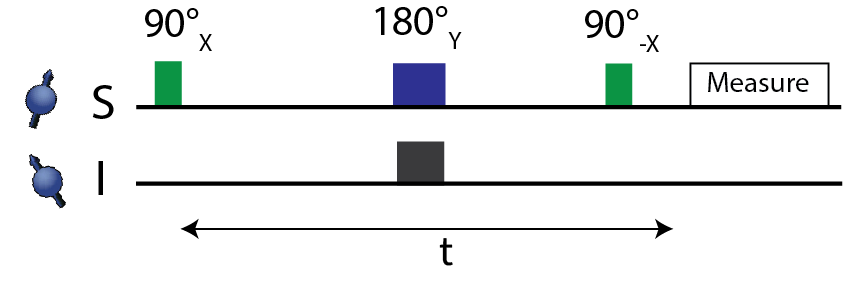
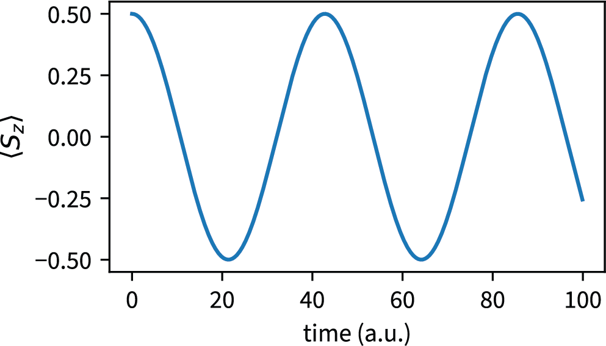
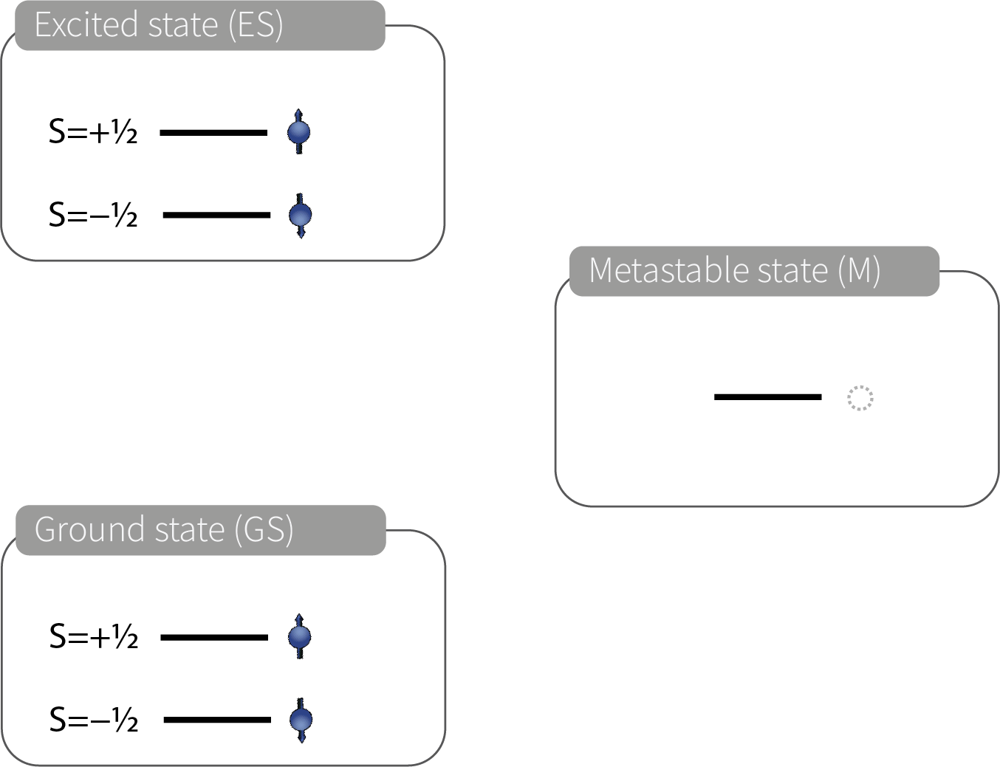
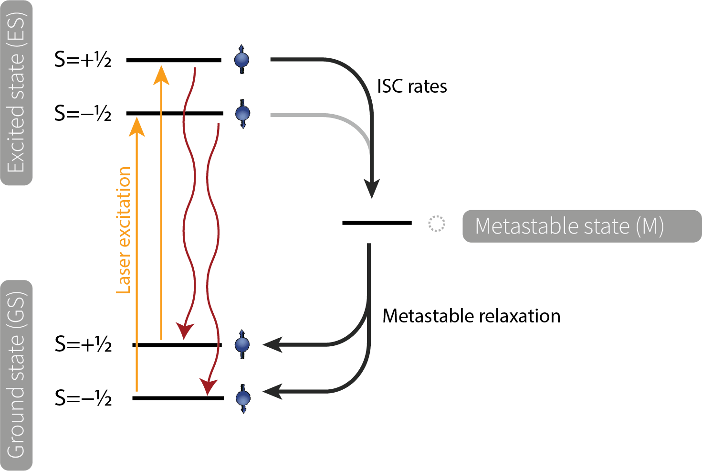
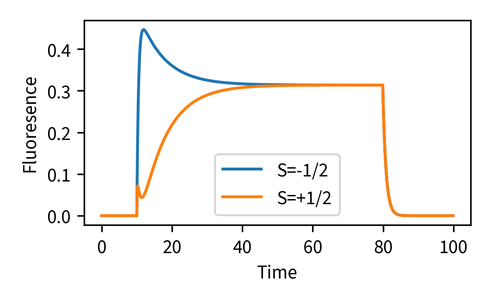

.. _Tutorial:

Tutorial
========

The aim of this tutorial is to introduce the basic notation in SimOS. 
To illustrate the clean and mathematically driven syntax, we showcase the simulation of very simple examples.

Double Electron-Electron Resonance (DEER) 
-----------------------------------------

DEER or PELDOR is a pulsed EPR technique that can be used to measure the distance between two unpaired electrons. 
It is a powerful tool to provide insight into biomolecule structure, and has been used to study the structure of membrane proteins,
protein--protein interactions, and protein--DNA interactions.
The technique is based on the dipolar interaction between two unpaired electrons. 
Briefly, a spin echo experiment is performed on one of the spins, while the second spin is flipped simultaneously with a refocusing pulse.

|

The distance between the two spins can be extracted from the modulation of the echo intensity as a function of the delay time between the two pulses.

.. code-block:: Python

    import numpy as np
    import sympy as sp
    import simos as sos

First, we need to define the system. In this case, we include two spins, :math:`S=1/2` and :math:`I=1/2`.

.. code-block:: Python

    system_def = []
    system_def.append({'name':'S','val':1/2})
    system_def.append({'name':'I','val':1/2})
    s = sos.System(system_def,'sympy')  

For now, we will work with the symbolic backend :code:`sympy` and will in the following define symbols for the variables of our simulation (e.g.  :math:`r, \theta \dots`). 
However, the identical syntax could also be used to perform a numerical calculation. The only changes required are to switch the :code:`method='sympy'` to e.g., to :code:`method='qutip'`
and to assign numerical values to all symbolic variables.

.. code-block:: Python

    r,th,phi,y1,y2,t = sp.symbols('r,theta,phi,gamma_1,gamma_2,t', real=True,positive=True)

Next, we define the system Hamiltonian. Here, we consider the secular part of a dipolar interaction between the two spins. 

.. math::

    \hat{H} = -\frac{\mu_0\gamma_1\gamma_2\hbar^2}{4\pi r^5 } \left[3 \left(\hat{\vec{S}} \cdot \vec{r}\right) \left(\hat{\vec{I}} \cdot \vec{r}\right) - \hat{\vec{S}} \cdot \hat{\vec{I}}\right]

.. code-block:: Python

    H0 = sos.dipolar_coupling(s,'S','I',y1,y2,r,th,phi,approx='secular')

We can simplify the Hamiltonian further in order to reduce the number of terms. This is not necessary, but can be useful for obtaining a brief output.

.. code-block:: Python

    Hsimple = sos.symbolic_replace_all(H0,1,r,th)

Next, we need to define the initial state of the system. In this case, we start with both spins in the down state.

.. code-block:: Python

    psi0 = sos.state(s,'S[-0.5],I[-0.5]')

Looking at the pulse sequence, we see that the first step is to rotate the :code:`S` spin by :math:`\pi/2` around the :math:`x`-axis.

.. code-block:: Python

    psi = sos.rot(s.Sx,sp.pi/2,psi0)

The next step is to evolve the system under the Hamiltonian for a time :math:`t/2`.

.. code-block:: Python

    psi = sos.evol(H0,t/2,psi)

The refocusing is done on both spins, S and I, by rotating them by :math:`\pi` around the :math:`y`-axis.

.. code-block:: Python

    psi = sos.rot(s.Sy,sp.pi,psi)
    psi = sos.rot(s.Iy,sp.pi,psi)

Finally, we evolve the system under the Hamiltonian for another :math:`t/2` and flip the S spin back to the down state.

.. code-block:: Python

    psi = sos.evol(H0,t/2,psi)
    psi = sos.rot(s.Sx,-sp.pi/2,psi0)

We perform a measurement of the :math:`\hat{S}_z` operator to obtain the expectation value of the measurement.

.. code-block:: Python

    m = sos.expect(s.Sz,rho)

This yields the expectation value of the measurement, which is proportional to

.. math::

    \langle S_z \rangle \propto\cos{\left(\frac{3 t \sin^{2}{\left(\theta \right)}}{8 \pi r^{3}} - \frac{t}{4 \pi r^{3}} \right)}

Numerical simulation
^^^^^^^^^^^^^^^^^^^^

To convert this simulation into a numerical simulation, the :code:`method='sympy'` argument in the initalization of our `Spinsystem` needs to be changed, e.g., :code:`method='qutip'`.
Now we can use a simple for-loop to evaluate the evolution trajectory.

.. code-block:: Python

    import numpy as np
    import simos as sos

    S = {'name':'S','val':1/2}  	
    I = {'name':'I','val':1/2}
    s = sos.System([S,I],'qutip')

    r, theta, phi = ...

    H0 = sos.dipolar_coupling(s,'S','I',sos.yH1,yF19,r,theta,phi,approx='secular')

    psi0 = sos.state(s,'S[-0.5],I[-0.5]')

    dt = ...
    store = []
    for i in range(100):
      psi = sos.rot(s.Sx,np.pi/2,psi0)
      psi = sos.evol(H0,i*dt/2,psi)
      psi = sos.rot(s.Sy,np.pi,psi)
      psi = sos.rot(s.Iy,np.pi,psi)
      psi = sos.evol(H0,i*dt/2,psi)
      psi = sos.rot(s.Sy,np.pi,psi)
      psi = sos.rot(s.Sx,-np.pi/2,psi0)
      m = sos.expect(s.Sz,rho)
      store.append(m)

You can now plot the expectation value of the measurement as a function of time.

.. code-block:: Python

    import matplotlib.pyplot as plt
    plt.plot(np.arange(len(store))*dt,store)
    plt.xlabel('Time')
    plt.ylabel('Expectation value of $S_z$')
    plt.show()

|

Spin-dependent fluoresence of an optically adressable spin
----------------------------------------------------------

The NV center in diamond is a promising candidate for quantum sensing and quantum information processing.
Here, we aim to simulate the dynamics of an artificial optically adressable spin inspired by the NV center.
The idea is to provide a stripped-down version of the simulation, focusing on the essentials. 
For more detailed simulations and physical models, we refer to the :ref:`NV section <nvcenter>`.

Let's consider a 5-level system with the following energy levels:

|

We can build the system as follows:

.. code-block:: Python

    import numpy as np
    import sympy as sp
    import simos as sos

    system_def = []
    S = {'name':'S','val':1/2}
    GS = {'name':'GS','val':0}
    ES = {'name':'ES','val':0}
    M = {'name':'M','val':0}

    s = sos.System(([S,(GS,ES)],M))

Next, we will need to define transition rates between the different levels. We will consider the following transitions:

|
We can use the `transition_operators` function to define the transition rates.

.. code-block:: Python

    rates = {}

    # Optical decay
    rates['ES,S[0.5]->GS,S[0.5]'] = 1e6
    rates['ES,S[-0.5]->GS,S[-0.5]'] = 1e6

    # ISC rates
    rates['S[-0.5],ES->M'] = .1e6
    rates['S[0.5],ES->M'] = 10e6

    # Metastable relaxation
    rates['M->GS,S[0.5]'] = 0.1e6
    rates['M->GS,S[-0.5]'] = 0.1e6

    c_ops = sos.transition_operators(s,rates)

.. attention::
    Rate definitions must include the spin state if the transition is supposed to be spin-conserving. Therefore, we write `ES,S[0.5]->GS,S[0.5]` instead of `ES->GS`. If the spin state is not included, the transition is assumed to be spin-flipping.

We want to see how the fluoresence of the system changes over time if we turn on a laser that excites from the ground state to the excited state. Therefore, we need to define the laser transition rates.

.. code-block:: Python

    # Laser excitation
    ratesLaser = {}
    ratesLaser['GS,S[0.5]->ES,S[0.5]'] = 1e6
    ratesLaser['GS,S[-0.5]->ES,S[-0.5]'] = 1e6

    c_opsLaser = sos.transition_operators(s,ratesLaser)

We can now initilaize the system into the S=1/2 state and into the S=-1/2 state of the ground state manifold.

.. code-block:: Python

    rho0 = sos.state(s,'S[0.5],GS')
    rho1 = sos.state(s,'S[-0.5],GS')

Our observable, the fluoresence, is proportional to the population of the excited state. We assume no Hamiltonian (:code:`s.id*0`). We can now run the simulation:

.. code-block:: Python

    store0 = []
    store1 = []
    dt = .1e-6

    for i in range(1000):
        if i > 100 and i < 800:
            # Laser is on
            rho0 = sos.evol(s.id*0,dt,rho0,c_ops = c_ops + c_opsLaser)
            rho1 = sos.evol(s.id*0,dt,rho1,c_ops = c_ops + c_opsLaser)
        else:
            # Laser is off
            rho0 = sos.evol(s.id*0,dt,rho0,c_ops = c_ops)
            rho1 = sos.evol(s.id*0,dt,rho1,c_ops = c_ops)
        store0.append(sos.expect(s.ESid,rho0))
        store1.append(sos.expect(s.ESid,rho1))

We can now plot the fluoresence as a function of time:

.. code-block:: Python
    
    import matplotlib.pyplot as plt
    tax = np.arange(len(store0))*dt*1e6
    plt.plot(tax,store0,label='S=1/2')
    plt.plot(tax,store1,label='S=-1/2')
    plt.xlabel('Time')
    plt.ylabel('Fluoresence')
    plt.legend()
    plt.show()

Numerical optimization
^^^^^^^^^^^^^^^^^^^^^^

Note that the above implementation is by no means the most efficient way to simulate this system. It is intended to be a simple example to illustrate the basic concept. You can improve the performance e.g. by caching the propagators for Laser on and off (in :code:`Uon` or :code:`Uoff`, respectivly).

.. code-block:: Python

    rho0 = sos.state(s,'S[0.5],GS')
    rho1 = sos.state(s,'S[-0.5],GS')
    rho0 = sos.ket2dm(rho0)
    rho1 = sos.ket2dm(rho1)

    store0 = []
    store1 = []
    dt = .1e-6

    Uon = sos.evol(s.id*0,dt,c_ops = c_ops + c_opsLaser)
    Uoff = sos.evol(s.id*0,dt,c_ops = c_ops)

    for i in range(1000):
        if i > 100 and i < 800:
            # Laser is on
            rho0 = sos.applySuperoperator(Uon,rho0)
            rho1 = sos.applySuperoperator(Uon,rho1)
        else:
            # Laser is off
            rho0 = sos.applySuperoperator(Uoff,rho0)
            rho1 = sos.applySuperoperator(Uoff,rho1)
        store0.append(sos.expect(s.ESid,rho0))
        store1.append(sos.expect(s.ESid,rho1))

This reduces the run-time by a factor of at least 20.